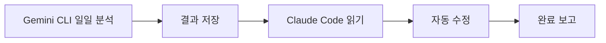

# Gemini CLI + Claude Code 워크플로우 사용 가이드

## 🚀 빠른 시작

### 1. Gemini CLI 설정 (선택사항)
실제 Gemini CLI를 사용하려면 다음 스크립트를 수정하세요:
- `.ai-workflow/scripts/gemini-daily.bat`
- `.ai-workflow/scripts/gemini-research.bat`
- `.ai-workflow/scripts/gemini-review.bat`

각 스크립트의 주석 처리된 Gemini CLI 호출 부분을 실제 명령어로 교체하세요.

### 2. 일일 분석 실행

**Windows:**
```cmd
cd .ai-workflow\scripts
gemini-daily.bat
```

**Linux/Mac:**
```bash
cd .ai-workflow/scripts
chmod +x gemini-daily.sh
./gemini-daily.sh
```

### 3. Claude Code에서 결과 활용

Claude Code를 열고 다음 슬래시 커맨드를 실행:

```
/gemini-daily
```

Claude가 자동으로:
1. 최신 분석 결과 읽기
2. 액션 아이템 처리
3. 수정 사항 적용

## 📋 주요 워크플로우

### 일일 코드 분석 & 개선



**실행 방법:**
1. `gemini-daily.bat` 실행 (아침/저녁)
2. Claude Code에서 `/gemini-daily` 실행
3. 자동으로 처리 가능한 항목들이 수정됨

### 기술 리서치 & 적용


**실행 방법:**
1. `gemini-research.bat "주제"` 실행
   ```cmd
   gemini-research.bat "Spring Security vs JWT 비교"
   ```
2. Claude Code에서 `/gemini-research` 실행
3. 추천 옵션 검토 및 구현

### 코드 리뷰 & 수정


**실행 방법:**
1. `gemini-review.bat "PR-123"` 실행
2. Claude Code에서 `/gemini-review` 실행
3. 즉시 수정 가능한 항목들이 자동 처리됨

## 🎯 사용 시나리오

### 시나리오 1: 아침 루틴
```cmd
# 1. 전날 변경사항 분석
gemini-daily.bat

# 2. Claude Code 열기
# 3. 슬래시 커맨드 실행
/gemini-daily

# 결과: 자동으로 코드 품질 개선, 버그 수정, 리팩토링 완료
```

### 시나리오 2: 새로운 기술 도입
```cmd
# 1. 리서치 수행
gemini-research.bat "React Query vs SWR vs RTK Query"

# 2. Claude Code에서 결과 확인
/gemini-research

# 3. 추천 옵션 승인 후 구현
# 결과: 단계별 가이드에 따라 자동 구현
```

### 시나리오 3: PR 리뷰
```cmd
# 1. PR 리뷰 수행
gemini-review.bat "PR-456"

# 2. Claude Code에서 수정
/gemini-review

# 결과: 지적사항 자동 수정, 논의 필요 사항 정리
```

## 🔧 커스터마이징

### 프롬프트 템플릿 수정

템플릿 파일들을 수정하여 분석 기준을 변경할 수 있습니다:

- `.ai-workflow/templates/daily-analysis.txt` - 일일 분석 기준
- `.ai-workflow/templates/research.txt` - 리서치 항목
- `.ai-workflow/templates/code-review.txt` - 코드 리뷰 체크리스트

### 슬래시 커맨드 수정

Claude Code 커맨드를 수정하여 동작 방식 변경:

- `.claude/commands/gemini-daily.md`
- `.claude/commands/gemini-research.md`
- `.claude/commands/gemini-review.md`

## 📊 출력 파일 구조

```
.ai-workflow/gemini-output/
├── daily-analysis/
│   ├── latest.md              # 최신 일일 분석 (심볼릭 링크)
│   ├── analysis_20250117_090000.md
│   └── analysis_20250117_180000.md
│
├── research/
│   ├── latest.md              # 최신 리서치
│   ├── Spring_Security_vs_JWT_20250115.md
│   └── React_Query_vs_SWR_20250116.md
│
└── code-review/
    ├── latest.md              # 최신 리뷰
    ├── review_PR-123_20250114.md
    └── review_abc123def_20250115.md
```

## ⚙️ 자동화 설정

### Windows Task Scheduler로 일일 분석 자동화

1. Task Scheduler 열기
2. "Create Basic Task" 선택
3. 이름: "Gemini Daily Analysis"
4. Trigger: Daily, 오전 9시
5. Action: Start a program
6. Program: `C:\Users\USER\Desktop\Spring-React-MySQL\.ai-workflow\scripts\gemini-daily.bat`

### Linux Cron으로 자동화

```bash
# crontab -e
0 9 * * * cd /path/to/project/.ai-workflow/scripts && ./gemini-daily.sh
0 18 * * * cd /path/to/project/.ai-workflow/scripts && ./gemini-daily.sh
```

## 💡 팁 & 모범 사례

### Gemini CLI 활용
- ✅ 대규모 분석은 Gemini에게 (하루 1-2회)
- ✅ 복잡한 비교/리서치는 Gemini에게
- ✅ 중요 PR만 Gemini로 리뷰

### Claude Code 활용
- ✅ 일상적인 코딩은 Claude Code로
- ✅ 빠른 버그 수정은 Claude Code로
- ✅ Gemini 분석 결과 기반 자동 수정

### 효율적인 협업
1. **아침**: Gemini 일일 분석 → Claude 자동 수정
2. **리서치 필요시**: Gemini 비교 분석 → Claude 구현
3. **PR 전**: Gemini 종합 리뷰 → Claude 수정

## 🐛 문제 해결

### Gemini CLI 연결 실패
- API 키 확인
- 네트워크 연결 확인
- 스크립트 권한 확인

### Claude Code가 파일을 찾지 못함
- `.ai-workflow/gemini-output/*/latest.md` 파일 존재 확인
- 경로가 정확한지 확인

### 자동 수정이 작동하지 않음
- Gemini 분석 결과의 "Claude Code 액션 아이템" 형식 확인
- 파일 경로와 라인 번호가 정확한지 확인

## 📚 참고 자료

- [Gemini CLI 문서](#)
- [Claude Code 문서](https://docs.claude.com/claude-code)
- [프로젝트 README](./../README.md)
